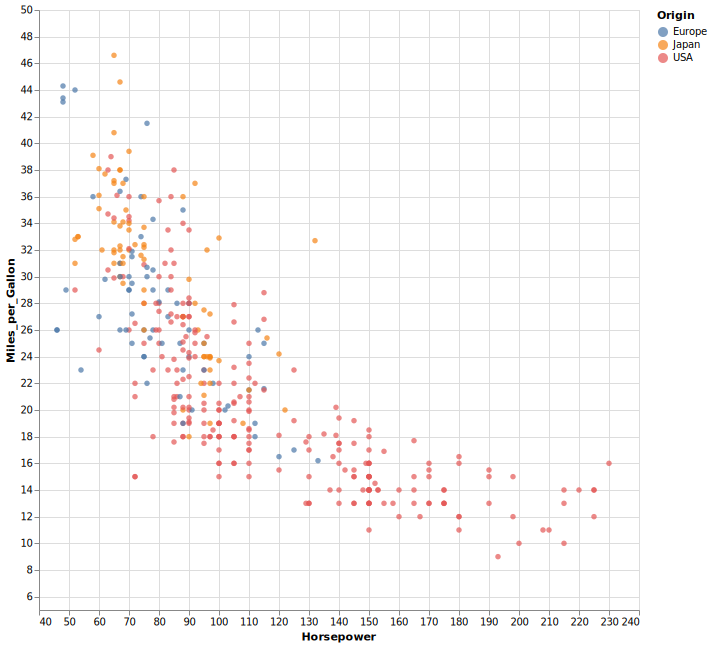

# Scaltair

[](https://maven-badges.herokuapp.com/maven-central/ch.unibas.cs.gravis/scaltair_3) 

Simple plotting library for Scala based on [Vega-Lite](https://vega.github.io/vega-lite/), inspired by Python's [Vega-Altair](https://altair-viz.github.io/gallery/index.html).

Plots can be rendered in the browser or from within a jupyter-notebook. 

### Example

Here is an example using Scaltair to quickly visualize and display a dataset with the native Vega-Lite renderer in the browser:

```scala 
import scaltair.*
import scaltair.PlotTargets.plotTargetBrowser
import scaltair.vegalite.datasets.VegaDatasets

@main def examplePlot() = 
  val data = VegaDatasets.loadCars().get
  val plot = Chart(data)
    .encode(
      Channel.X("Horsepower", FieldType.Quantitative),
      Channel.Y("Miles_per_Gallon", FieldType.Quantitative),
      Channel.Color("Origin")
    )
    .markCircle()
    .show()
```



### Getting started

See the [quickstart Guide](docs/quickstart.md). 


### Status of the project

The project is in an early stage and the api might still be subject to changes. 
It supports a subset of the functionality provided by 
vega-lite and altair. While it can already produce most plots used in a typical scientific context or 
data analysis task, it cannot create interactive plots nor does it support temporal data. 

It should be easy to add the missing functionality if this is required. The project is designed in such a way, that it is easy to understand and straight-forward to extend. It does not make use of any fancy language features or libraries. Pull requests are very welcome.


### Trying it out

While there is not yet an official version released, a snapshot release can be found 
on sonatype. To try it out, add the following dependency to your `build.sbt`:

```
resolvers +=  Resolver.sonatypeRepo("snapshots"), 
libraryDependencies += "ch.unibas.cs.gravis" %% "scaltair" % "0.1-SNAPSHOT"
```

##### Adding new features
Adding new features consists of two simple steps:

1. Add a case class in the package `scaltair.vegalite` representing the corresponding Vega construct and define how it is mapped to json. 
2. Expose the functionality in the high-level dsl defined in `scaltair.Chart`. 

